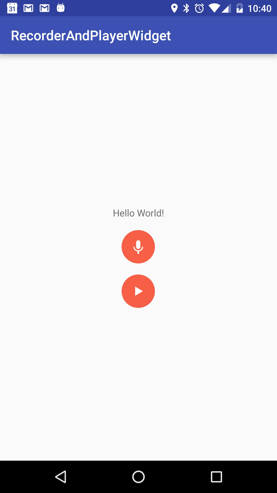
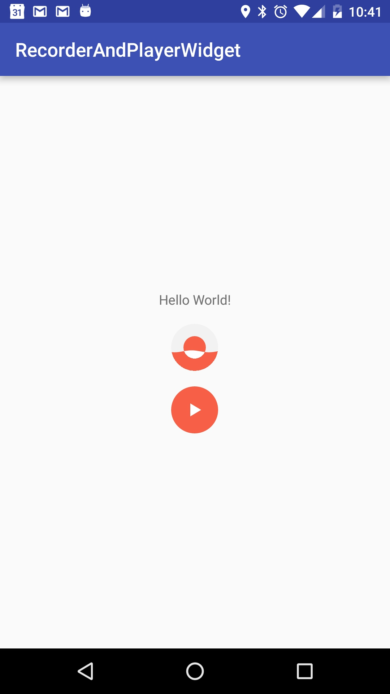
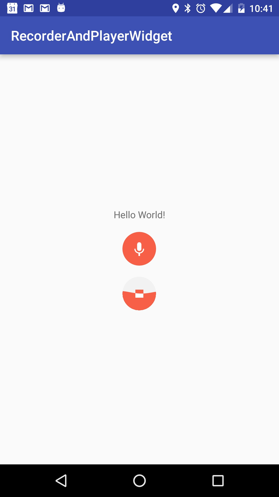

# RecorderAndPlayerWidget
An beautiful android widget to display animation when user is recording voice or playing audio.

Screenshots
---------------

How to use
---------------
Import `com.jp.recorderandplayer.recorderview.RecorderView` and `com.jp.recorderandplayer.recorderview.PlayerView` into your layout
